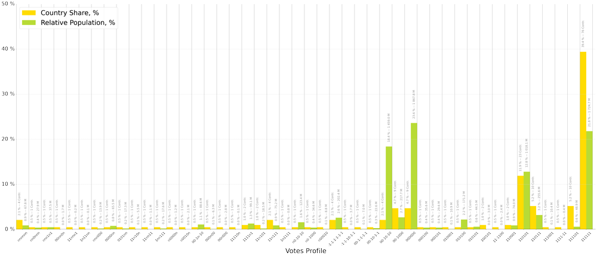
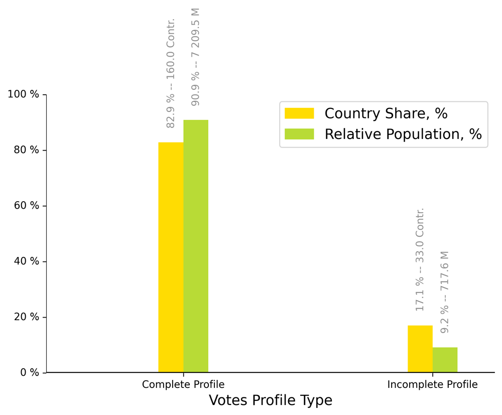
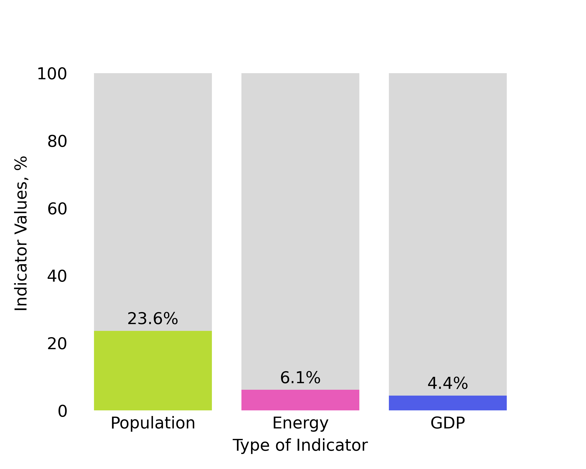
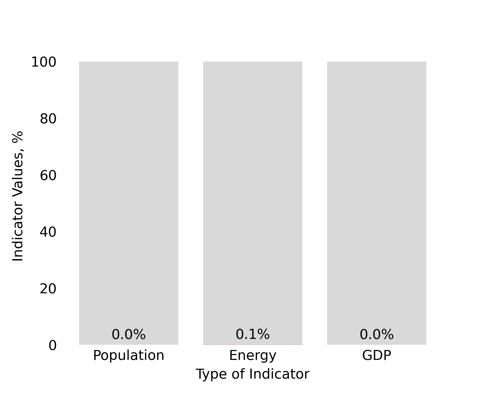

[Anatomy of Solidarity in UN Voting](https://sobolsky.github.io/un)
# 1. Ukraine Political Conditions (2022–2023). Research Highlights

## Intro
This is the first article in a series dedicated to summarizing the voting outcomes of the United Nations General Assembly (UNGA) on six resolutions within the theme ‘UKRAINE - POLITICAL CONDITIONS’ for the years 2022–2023. At the time of publication of this article, the UNGA voting in 2024 on this topic had not taken place.

List of resolutions examined in this study:

* [A/RES/ES-11/6](https://digitallibrary.un.org/record/4003921){:target="_blank"} Principles of the Charter of the United Nations underlying a comprehensive, just and lasting peace in Ukraine / 2023–02–23
* [A/RES/ES-11/5](https://digitallibrary.un.org/record/3994052){:target="_blank"} Furtherance of remedy and reparation for aggression against Ukraine / 2022–11–14
* [A/RES/ES-11/4](https://digitallibrary.un.org/record/3990400){:target="_blank"} Territorial integrity of Ukraine : defending the principles of the Charter of the United Nations / 2022–10–12
* [A/RES/ES-11/3](https://digitallibrary.un.org/record/3967778){:target="_blank"} Suspension of the rights of membership of the Russian Federation in the Human Rights Council / 2022–04–07
* [A/RES/ES-11/2](https://digitallibrary.un.org/record/3965954){:target="_blank"} Humanitarian consequences of the aggression against Ukraine / 2022–03–24
* [A/RES/ES-11/1](https://digitallibrary.un.org/record/3959039){:target="_blank"} Aggression against Ukraine / 2022–03–02

In the General Assembly of the United Nations, a total of 193 countries can participate in the voting on resolutions. Each country has one vote. For more information about the participating countries in the UN General Assembly, please refer to the official UN website.

The aim of this study is to identify international political multipolarity within the context of UN General Assembly (UNGA) voting. To achieve this, a voting network was constructed to identify clusters, or `Solidarity Groups` (for more details about `Solidarity Groups`, please see below in this article.) This voting network was built based on the voting outcomes of these six resolutions. Henceforth, this network will be referred to as the `Solidarity Network`.

The main content of this study involves morphological and quantitative analyses of `Solidarity Groups` within the `Solidarity Network`. Morphological analysis entails examining the composition of `Solidarity Groups` within the `Solidarity Network` and the degree of interconnectedness among them.

Quantitative analysis of `Solidarity Groups` is based on three indicators for each of the 193 countries:

* **Population mid-year estimates** (millions), 2022. This indicator represents an estimate of the population size of each country in the middle of 2022, measured in millions of people. In tables and bar plots, this indicator will be denoted as **Population, M**.

* **Primary energy production** (PJ), 2020. Primary energy refers to energy derived directly from natural sources such as oil, gas, coal, nuclear fuel, hydro, wind, solar energy, etc. This indicator allows assessing the degree of a country's self-sufficiency in energy production and the sources of energy it utilizes. It is measured in petajoules (PJ), which is a unit of energy equal to 10¹⁵ joules. In tables and bar plots, this indicator will be denoted as **Energy, PJ**.

* **GDP in current prices** (millions of US dollars), for the year 2021. This represents an estimate of the gross domestic product (GDP) of each country at current prices as of the end of 2021, measured in millions of US dollars. In tables and bar plots, this indicator will be denoted as **GDP, M$**.

> These data were obtained from the [Statistical Yearbook 66th issue (2023)](https://unstats.un.org/UNSDWebsite/Publications/StatisticalYearbook/){:target="_blank"}.

Below in **Fig. 1** is the `Complete Solidarity Network`. This network is the key outcome of the study on voting regarding the theme of *Ukraine Political Conditions (2022–2023) in the UN*. Subsequently, in this article, the principles of constructing this network will be discussed, along with some research findings based on it.

**Fig. 1** Anatomy of Solidarity in UN Voting: Ukraine Political Conditions (2022–2023). `Complete Solidarity Network` (Population). Node sizes correspond to population density. [Click to enlarge the full network image](res/upc_full.jpg){:target="_blank"}

> **Download** the `Complete Solidarity Network (Population)` in JPEG format [usg_full.jpg](res/upc_full.jpg){:target="_blank"}.

> **Download** the `Solidarity Network` in GEXF format ([UN_UKRAINE - POLITICAL_CONDITIONS_full_network.gexf](res/UN_UKRAINE--POLITICAL_CONDITIONS_full_network.gexf))

## The content of this article
> ### 1. Voting Profiles
> ### 2. Solidarity Groups
>> **2.1 Complete Solidarity Groups**
>>
>> **2.2 Incomplete Solidarity Groups**
>
> ### 3. Solidarity Network. Construction Principle
> ### 4. Complete Solidarity Groups
>> 4.1. Group –1–1–1–1–1–1
>> 
>> 42.2. Group 00–10–10
>> 
>> 2.3. Group00–1000
>> 
>> 2.4. Group 000000
>> 
>> 2.5. Group 100101
>> 
>> 2.6. Group110001
>> 
>> 2.7. Group110101
>> 
>> 2.8. Group110111
>> 
>> 2.9. Group111101
>> 
>> 2.10. Group111111
>
> ### 5. Conclusion

## 1. Voting Profiles
Each country can vote on each resolution in four different ways: for, against, abstain, and not participate in the vote. Let’s denote these possibilities as follows:

> **-1** — the country votes against the resolution,
> 
> **0** — the country abstains from voting,
> 
> **1** — the country votes for the resolution,
> 
> **n** — the country did not participate in the vote.

The `Voting Profile` for each country will be called a simple sequence, consisting of **-1**,** 0**, **1**, and **n**, reflecting the country’s position on each vote. The length of such a sequence for each country is the same and equals the number of resolutions on the voting topic. In our case, it’s six.

In the `Voting Profile`, these symbols are arranged in chronological order, starting with the result of the earlier resolution and ending with the result of the later one.

Thus, the first symbol in the `Voting Profile` of a participating country represents its position on resolution [A/RES/ES-11/1](https://digitallibrary.un.org/record/3959039){:target="_blank"}, the second symbol represents the position on resolution [A/RES/ES-11/2](https://digitallibrary.un.org/record/3965954){:target="_blank"}, and so on, up to the sixth symbol, which corresponds to the vote on resolution [A/RES/ES-11/6](https://digitallibrary.un.org/record/4003921){:target="_blank"}.

For example, Russia voted “against” all resolutions, so its voting profile looks like this: -1–1–1–1–1–1. The United States voted “for” all resolutions, so its profile looks like this: 111111. The profile of Algeria, for instance, looks like this: 00–1000, and Afghanistan’s profile looks like this: 11n111. The first three profiles in the example are `Complete Voting Profiles`, as the countries with these profiles participated in all six votes on the resolutions.

A profile similar to Afghanistan’s voting profile in this study will be referred to as an Incomplete Voting Profile because countries with such `Voting Profiles` have missed at least one vote on any resolution.

An `Incomplete Voting Profile` can include skips in different numbers of votes, from one, as in the case of Afghanistan, to all six votes, as in the case of Azerbaijan (its `Voting Profile`: nnnnnn).

Thus, `Voting Profiles` can not only be categorized into complete and incomplete, but also ranked based on the `Voting Participation Degree`. The `Voting Participation Degree` is a number from 0 to 1, where 0 corresponds to the Voting Profile of a country that did not participate in any of the votes, and 1 corresponds to the profile of a country with a `Complete Voting Profile`.

The `Voting Participation Degree` is calculated as the ratio of the actual number of votes to the maximum possible (in our case, 6). For example, the Voting Profile for Afghanistan (11n111) would be 5/6 or ~0.8. The `Voting Participation Degree` indicates the involvement of a particular country in the voting process on the entire topic.

Below, in **Table 1.1.1**, a list of all participating countries in the UNGA is provided, along with their `Voting Profiles` on the topic, arranged in order of increasing `Voting Participation Degree`. Additionally, for each country in the table, a demographic indicator is provided — population estimates for 2022 according to UN data in millions of people (Population, M).

**Table 1.1.1.** List of all 193 participating countries in the UNGA and their `Voting Profiles` on the topic, arranged in order of increasing `Voting Participation Degree`.

Thus, all 193 participating countries formed 46 `Voting Profiles`. **Table 1.1.2** provides key country-specific and demographic indicators for all 46 Voting Profiles for each `Voting Group`: Country Count; Population, M; Country Share, % (calculated as the ratio of the number of countries with the same Voting Profile to the total number of participating countries) and Relative Population, % (calculated as the ratio of the total population of countries with the same `Voting Profile` to the total population of all participating countries).

**Table 1.1.2.** Country and demographic indicators for all 46 `Voting Profiles` (aggregated by `Voting Profile`).

For clarity, below is a bar plot (**Fig. 1.1.1**) constructed based on the values of relative country-specific and demographic indicators from **Table 1.1.2**.

**Fig. 1.1.1** Relative country-specific and demographic Indicators for All 46 `Voting Profiles` (aggregated by `Votes profile`). [Click to enlarge the image](res/votes_profiles_reports/vp_plot_upc_2024.png){:target="_blank"}

Similarly to **Table 1.1.2**, **Table 1.1.3** has been constructed, where the Voting Participation Degree is used instead of the `Voting Profile` as the basis.

**Table 1.1.3** Country and demographic indicators for different values of the `Voting Participation Degree` (aggregated by `Voting Participation Degree`).

For clarity, below is a bar plot (**Fig. 1.1.2**) constructed based on the values of Country Share, %, and Relative Population, % from **Table 1.1.3**.

**Fig. 1.1.3** Relative country-specific and demographic indicators for all values of the `Voting Participation Degree`. [Click to enlarge the image](res/votes_profiles_reports/vpr_plot_upc_2024.png){:target="_blank"}

Similarly to the previous two tables, **Table 1.1.4** has been constructed to compare countries with complete and incomplete `Voting Profiles`. The values in this table can indicate the degree of involvement in the voting process for countries with these types of `Voting Profiles`. That is, the majority of countries (160 out of 193, 83%) are fully engaged in the voting topic, as they have a `Complete Voting Profile`.

**Table 1.1.4.** Country-specific and demographic indicators for two types of countries — those with complete and incomplete `Voting Profiles`.

Below is a bar plot (**Fig. 1.1.4**) constructed based on the values of Country Share, %, and Relative Population, % from **Table 1.1.4**.

**Fig. 1.1.4** Country-specific and demographic indicators for two types of countries — those with complete and incomplete `Voting Profiles`. [Click to enlarge the image](res/votes_profiles_reports/vpt_plot_upc_2024.png){:target="_blank"}

Below, in **Fig. 1.1.5** and **Fig. 1.1.6**, two maps are provided, showing countries with complete and incomplete `Voting Profiles` respectively. The size of the circles corresponds to the values of `Relative Population`, % of these countries.

**Fig. 1.1.5** Countries with `Complete Voting Profiles` and their Relative Population, %. [Click to enlarge the image](res/votes_profiles_reports/full_prof_world_map_2024.png){:target="_blank"}

**Fig. 1.1.6** Countries with `Incomplete Voting Profiles` and their Relative Population, %. [Click to enlarge the image](res/votes_profiles_reports/no_full_prof_world_map_2024.png){:target="_blank"}

> **The main conclusion** that can be drawn from the analysis of `Voting Profiles` is that countries with the most active participation in voting (with `Complete Voting Profiles`) have significant weight both in terms of the number of countries (82% of all participating countries) and in terms of population (90% of the total population of participating countries).

## 2. Solidarity Groups

These is group of countries that have at least one identical voting position.

### 2.1 Complete Solidarity Groups
If two or more countries have the same `Complete Voting Profile`, these countries form groups, which will be referred to as `Complete Solidarity Groups` here. `Complete Solidarity` Group consists of countries with identical `Complete Voting Profiles`. Countries within the same `Complete Solidarity Group` always vote the same way on all resolutions (here, each country participates in six votes).

Let’s agree that `Complete Solidarity Groups` cannot consist of countries with `Incomplete Voting Profiles`. That is, groups where the voting profile includes one or more “n” values are excluded from `Complete Solidarity Groups`. This is because the focus is on solidarity in UN General Assembly voting, not on “non-attendance solidarity.” Overall, the reasons why a particular country did not attend the vote can be diverse and depend on the specific situation and political context of each country.

In total, there are 21 `Complete Voting Profiles` for this voting theme: -1–1–1–1–1–1, -1–1–10–1–1, 00–1–1–1–1, 00–10–1–1, 00–10–10, 00–1000, 000000, 000100, 000101, 010001, 010100, 010101, 100101, 11–1100, 110001, 110101, 110111, 111001, 1111–11, 111101, 111111. Among them, groups with two or more countries form 10 profiles. Thus, for the “UKRAINE — POLITICAL CONDITIONS” theme for 2022–2023, 10 `Complete Solidarity Groups` have formed. These profiles, along with their country-specific and demographic indicators, are provided below in **Table 1.2.1**.

**Table 1.2.1** `Complete Solidarity Groups` with country-specific and demographic Indicators.

Below, based on the relative country-specific and demographic indicators from **Table 1.2.1**, a bar plot **Fig. 1.2.1** is constructed.

**Fig. 1.2.1** `Complete Solidarity Groups` with country-specific and demographic Indicators. [Click to enlarge the image](res/sol_groups_reports/csg_plot_upc_2024.png){:target="_blank"}

Below, **Table 1.2.2** compares these indicators for countries forming `Complete Solidarity Groups` and other `Voting Profile` countries in the voting (“Other Countries Groups” in the table).

**Table 1.2.2** Indicators for countries forming `Complete Solidarity Groups` and Other Countries Groups in the voting.

**Fig. 1.2.2** Country-specific and demographic indicators for Complete Solidarity Group countries and Other Countries Groups in the voting. [Click to enlarge the image](res/sol_groups_reports/tsg_plot_upc_2024.png){:target="_blank"}

> **The main conclusion** drawn from comparing `Complete Solidarity Group` countries with other participating countries in the voting is that the countries forming `Complete Solidarity Groups` hold significant weight both in terms of the number of countries (77% of all participating countries) and the population size (86% of the total population of participating countries). In the `Solidarity Network`, these form the main core clusters of the network.

### 2.2 Partial Solidarity Groups

In `Complete Solidarity Groups`, solidarity between countries is maximum and equals 6 (6 out of 6 possible matches in voting). The `Partial Solidarity Group` consists of countries with identical values in their Solidarity Profiles at corresponding positions, but not ‘n’.

Countries that do not have full solidarity among them can form groups with varying Solidarity Degree. The `Solidarity Degree` of a `Solidarity Group` is calculated as the ratio of the number of identical values in the `Voting Profiles` to the total number of votes, expressed both as a percentage and numerically (whole numbers from 1 to the total number of votes).

For example, a country with aVoting Profile of 111111 and a country with a `Voting Profile` of 111011 are in solidarity in their voting in 5 out of 6 cases, meaning their `Solidarity Degree` is 83% (their voting outcomes align on all resolutions except the 4th).

Another example is a country with a `Voting Profile` of 00–1n-10 and a country with a `Voting Profile` of 0000nn, which are in solidarity in 2 out of 6 cases, resulting in a `Solidarity Degree` of 33% (their voting outcomes match only on the first two resolutions).

Groups of countries with a `Solidarity Degree` less than 100% will be referred to as Partial `Solidarity Groups`.

For example, for the group of countries with a `Voting Profile` of 111111, there are groups of countries with `Voting Profiles` whose Solidarity Degree is 5/6 or 83%. Here are six profiles of these groups: 110111, 111101, 1111–11, 1111n1, 11n111, 1n1111. In other words, countries with these seven Voting Profiles form a `Partial Solidarity Group` with a `Solidarity Degree` of 83%. Furthermore, as the `Solidarity Degree` decreases, groups with `Solidarity Degrees` of 4/6 (67%), 3/6 (50%), 2/6 (33%), 1/6 (17%) will be formed.

## 3. Solidarity Network. Construction Principle

In general, the `Solidarity Network` is a network where the nodes represent voting participant countries, and the edges represent solidarity connections, with weights expressed in integer values of `Solidarity Degree` (whole numbers from 1 to the total number of resolutions).

Thus, when comparing the `Voting Profiles` of all 193 participating countries, many of these countries will be linked to specific `Solidarity Degree` values.

Subsequently, this study will explore a network model (graph) constructed based on the connections between countries (nodes) according to the aforementioned principle. The connections (edges) in this network have a degree (weight) of connectivity. This connectivity corresponds to the Solidarity Degree, but in the network, this degree (weights) is represented by natural numbers from 1 to 6.

This network will be referred to as the Solidarity Network here. The edge weights of this network can range from 1 to 6 and represent the `Solidarity Degree` between countries (nodes).

Essentially, the `Solidarity Degree` is a relative measure of the edge weights in the `Solidarity Network`. Countries in `Complete Solidarity Groups` have a `Solidarity Degree` of 100% (6/6) — the edge weight in the network is 6. Countries in `Partial Solidarity Groups` may have the following `Solidarity Degrees`: 83% (5/6) — the weight is 5; 67% (4/6) — the weight is 4; 50% (3/6) — the weight is 3; 33% (2/6) — the weight is 2; 17% (1/6) — the weight is 1.

The set of countries with `Solidarity Degrees` ranging from 100% (maximum) to 17% (minimum) is termed as the Threshold Solidarity Group. All other countries are outside this group and do not share an identical voting position with it on any resolution. The `Threshold Solidarity Group` includes all countries with a `Solidarity Degree` value not equal to zero.

The `Solidarity Network`, containing all voting participant countries and visualizing edges with all possible values of `Solidarity Degree` between these countries, is called the Complete `Solidarity Network`.

At the beginning of this article, the complete structure of this `Complete Solidarity Network` is provided. There are also links available for downloading in jpg and gexf formats.

To visualize the `Solidarity Network`, we used the Gephi software. The network layout was performed using the Fruchterman–Reingold algorithm. The generated network exhibits a pronounced polarization based on the degree of solidarity. The upper pole of this network is represented by countries with a Voting Profile of -1–1–1–1–1–1, while the lower pole is represented by countries with a Voting Profile of 111111.

Below, in **Fig. 1.3.1**, the `Solidarity Network` is depicted with lines drawn to represent a 100% Solidarity Degree Network. The 100% `Solidarity Degree Network` is the `Solidarity Network` that includes all participating voting countries and visualizes edges with `Solidarity Degree` values between these countries equal to 100% (weight = 1).

**Fig. 1.3.1** 100% Solidarity Degree Network (node sizes correspond to population density). [Click to enlarge the image](res/single_group_short_reports/pict/net_pict/upc_100.jpg){:target="_blank"}

## 4. Complete Solidarity Groups

This section provides a brief overview of all 10 `Complete Solidarity Groups` (see **Table 1.2.1**). The `Complete Solidarity Groups` in this section are considered in the order of their arrangement in the `Solidarity Network` — from top to bottom. That is, from groups of countries that vote more “against” on all resolutions to the group of countries that vote “for” on all resolutions.

### 4.1 Group -1-1-1-1-1-1
The `Complete Solidarity Group` of countries (100% solidarity) with a Voting Profile of **–1–1–1–1–1–1** includes **4** UNGA member countries (the countries in this group voted against all 6 resolutions):

**Table 4.1.1** The -1–1–1–1–1–1 group composition with key indicators (sorted by Population size).

**Fig. 4.1.1** Network of the -1–1–1–1–1–1 group (node sizes correspond to population density). [Click to enlarge the image](res/single_group_short_reports/pict/net_pict/-1-1-1-1-1-1_net_100.jpg){:target="_blank"}

**Map. 4.1.1** Countries of the -1-1-1-1-1-1 group on the map and the relative distribution of population density within them. [Click to enlarge the image](res/single_group_short_reports/pict/-1-1-1-1-1-1_map_2024.png){:target="_blank"}

**Table 4.1.2** Leading country in the -1–1–1–1–1–1 group by key indicators.

**Table 4.1.3** The -1–1–1–1–1–1 group indicator values relative to UNGA member countries.

**Diag. 4.1.1** The values of indicators for all countries in the -1–1–1–1–1–1 group relative to the values of these same indicators for all member countries of the UNGA.

**Map. 4.1.2** Countries of the -1–1–1–1–1–1 group on the map and the relative distribution of population density within them (red) and other UN General Assembly member countries (gray). [Click to enlarge the image](res/single_group_short_reports/pict/-1-1-1-1-1-1_world_map_2024.png){:target="_blank"}

### 4.2 Группа полной солидарности 00–10–10
The `Complete Solidarity Group` of countries (100% solidarity) with a Voting Profile of **00–10–10** includes **4** UNGA member countries:

**Table 4.2.1** The 00–10–10 group composition with key indicators (sorted by Population size).

**Fig. 4.2.1** Network of the 00–10–10 group (node sizes correspond to population density). [Click to enlarge the image](res/single_group_short_reports/pict/net_pict/00–10–10_net_100.jpg){:target="_blank"}

**Map. 4.2.1** Countries of the 00–10–10 group on the map and the relative distribution of population density within them. [Click to enlarge the image](res/single_group_short_reports/pict/00-10-10_map_2024.png){:target="_blank"}

**Table 4.2.2** Leading country in the 00–10–10 group by key indicators.

**Table 4.2.3** The 00–10–10 group indicator values relative to UNGA member countries.

**Diag. 4.2.1** The values of indicators for all countries in the 00-10-10 group relative to the values of these same indicators for all member countries of the UNGA.

**Map. 4.2.2** Countries of the 00-10-10 group on the map and the relative distribution of population density within them (red) and other UN General Assembly member countries (gray). [Click to enlarge the image](res/single_group_short_reports/pict/00-10-10_world_map_2024.png){:target="_blank"}

### 4.3 Group 00–1000
The `Complete Solidarity Group` of countries (100% solidarity) with a Voting Profile of **00–1000** includes **9** UNGA member countries:

**Table 4.3.1** The 00–1000 group composition with key indicators (sorted by Population size).

**Fig. 4.3.1** Network of the 00–1000 group (node sizes correspond to population density). [Click to enlarge the image](res/single_group_short_reports/pict/net_pict/00-1000_net_100.jpg){:target="_blank"}

**Map. 4.3.1** Countries of the 00–1000 group on the map and the relative distribution of population density within them. [Click to enlarge the image](res/single_group_short_reports/pict/00-1000_map_2024.png){:target="_blank"}

**Table 4.3.2** Leading country in the 00–1000 group by key indicators.

**Table 4.3.3** The 00–1000 group indicator values relative to UNGA member countries.

**Diag. 4.3.1** The values of indicators for all countries in the 00-1000 group relative to the values of these same indicators for all member countries of the UNGA

**Map. 4.3.2** Countries of the 00-1000 group on the map and the relative distribution of population density within them (red) and other UN General Assembly member countries (gray). [Click to enlarge the image](res/single_group_short_reports/pict/00-1000_world_map_2024.png){:target="_blank"}

### 4.4 Group 000000
The `Complete Solidarity Group` of countries (100% solidarity) with a Voting Profile of **000000** includes **9** UNGA member countries (the countries in this group abstained from voting on all resolutions):

**Table 4.4.1** The 000000 group composition with key indicators (sorted by Population size).

**Fig. 4.4.1** Network of the 0000000 group (node sizes correspond to population density). [Click to enlarge the image](res/single_group_short_reports/pict/net_pict/000000_net_100.jpg){:target="_blank"}

**Map. 4.4.1** Countries of the 000000 group on the map and the relative distribution of population density within them. [Click to enlarge the image](res/single_group_short_reports/pict/000000_map_2024.png){:target="_blank"}

**Table 4.4.2** Leading country in the 000000 group by key indicators.

**Table 4.5.3** The 000000 group indicator values relative to UNGA member countries.

**Diag. 4.4.1** The values of indicators for all countries in the 000000 group relative to the values of these same indicators for all member countries of the UNGA

**Map. 4.4.2** Countries of the 000000 group on the map and the relative distribution of population density within them (red) and other UN General Assembly member countries (gray). [Click to enlarge the image](res/single_group_short_reports/pict/000000_world_map_2024.png){:target="_blank"}

### 4.5 Group 100101
The `Complete Solidarity Group` of countries (100% solidarity) with a Voting Profile of **100101** includes **2** UNGA member countries:

**Table 4.5.1** The 100101 group composition with key indicators (sorted by Population size).

**Fig. 4.5.1** Network of the 100101 group (node sizes correspond to population density). [Click to enlarge the image](res/single_group_short_reports/pict/net_pict/100101_net_100.jpg){:target="_blank"}

**Map. 4.5.1** Countries of the 100101 group on the map and the relative distribution of population density within them. [Click to enlarge the image](res/single_group_short_reports/pict/100101_map_2024.png){:target="_blank"}

**Table 4.5.2** Leading country in the 100101 group by key indicators.

**Table 4.5.3** The 100101 group indicator values relative to UNGA member countries.

**Diag. 4.5.1** The values of indicators for all countries in the 100101 group relative to the values of these same indicators for all member countries of the UNGA.

**Map. 4.5.2** Countries of the 100101 group on the map and the relative distribution of population density within them (red) and other UN General Assembly member countries (gray). [Click to enlarge the image](res/single_group_short_reports/pict/100101_world_map_2024.png){:target="_blank"}

### 4.6 Group 110001
The `Complete Solidarity Group` of countries (100% solidarity) with a Voting Profile of **110001** includes **2** UNGA member countries:

**Table 4.6.1** The 110001 group composition with key indicators (sorted by Population size).

**Fig. 4.6.1** Network of the 110001 group (node sizes correspond to population density). [Click to enlarge the image](res/single_group_short_reports/pict/net_pict/110001_net_100.jpg){:target="_blank"}

**Map. 4.6.1** Countries of the 110001 group on the map and the relative distribution of population density within them. [Click to enlarge the image](res/single_group_short_reports/pict/110001_map_2024.png){:target="_blank"}

**Table 4.6.2** Leading country in the 110001 group by key indicators.

**Table 4.6.3** The 110001 group indicator values relative to UNGA member countries.

**Diag. 4.6.1** The values of indicators for all countries in the 110001 group relative to the values of these same indicators for all member countries of the UNGA.

**Map. 4.6.2** Countries of the 110001 group on the map and the relative distribution of population density within them (red) and other UN General Assembly member countries (gray). [Click to enlarge the image](res/single_group_short_reports/pict/110001_world_map_2024.png){:target="_blank"}

### 4.7 Group 110101
The `Complete Solidarity Group` of countries (100% solidarity) with a Voting Profile of **110101** includes **23** UNGA member countries:

**Table 4.7.1** The 110101 group composition with key indicators (sorted by Population size).

**Fig. 4.7.1** Network of the 110101 group (node sizes correspond to population density). [Click to enlarge the image](res/single_group_short_reports/pict/net_pict/110101_net_100.jpg){:target="_blank"}

**Map. 4.7.1** Countries of the 110101 group on the map and the relative distribution of population density within them. [Click to enlarge the image](res/single_group_short_reports/pict/110101_map_2024.png){:target="_blank"}

**Table 4.7.2** Leading country in the 1101011 group by key indicators.

**Table 4.7.3** The 1101011 group indicator values relative to UNGA member countries.

**Diag. 4.7.1** The values of indicators for all countries in the 110101 group relative to the values of these same indicators for all member countries of the UNGA.

**Map. 4.7.2** Countries of the 110101 group on the map and the relative distribution of population density within them (red) and other UN General Assembly member countries (gray). [Click to enlarge the image](res/single_group_short_reports/pict/110101_world_map_2024.png){:target="_blank"}

### 4.8 Group 110111
The `Complete Solidarity Group` of countries (100% solidarity) with a Voting Profile of **110111** includes **10** UNGA member countries:

**Table 4.8.1** The 110111 group composition with key indicators (sorted by Population size).

**Fig. 4.8.1** Network of the 110111 group (node sizes correspond to population density). [Click to enlarge the image](res/single_group_short_reports/pict/net_pict/110111_net_100.jpg){:target="_blank"}

**Map. 4.8.1** Countries of the 110111 group on the map and the relative distribution of population density within them. [Click to enlarge the image](res/single_group_short_reports/pict/110111_map_2024.png){:target="_blank"}

**Table 4.8.2** Leading country in the 110111 group by key indicators.

**Table 4.8.3** The 110111 group indicator values relative to UNGA member countries.

**Diag. 4.8.1** The values of indicators for all countries in the 110111 group relative to the values of these same indicators for all member countries of the UNGA.

**Map. 4.8.2** Countries of the 110111 group on the map and the relative distribution of population density within them (red) and other UN General Assembly member countries (gray). [Click to enlarge the image](res/single_group_short_reports/pict/110111_world_map_2024.png){:target="_blank"}

### 4.9 Group 111101
The `Complete Solidarity Group` of countries (100% solidarity) with a Voting Profile of **111101** includes **10** UNGA member countries:

**Table 4.9.1** The 111101 group composition with key indicators (sorted by Population size).

**Fig. 4.9.1** Network of the 111101 group (node sizes correspond to population density). [Click to enlarge the image](res/single_group_short_reports/pict/net_pict/111101_net_100.jpg){:target="_blank"}

**Map. 4.9.1** Countries of the 111101 group on the map and the relative distribution of population density within them. [Click to enlarge the image](res/single_group_short_reports/pict/111101_map_2024.png){:target="_blank"}

**Table 4.9.2** Leading country in the 111101 group by key indicators.

**Table 4.9.3** The 111101 group indicator values relative to UNGA member countries.

**Diag. 4.9.1** The values of indicators for all countries in the 111101 group relative to the values of these same indicators for all member countries of the UNGA.

**Map. 4.9.2** Countries of the 111101 group on the map and the relative distribution of population density within them (red) and other UN General Assembly member countries (gray). [Click to enlarge the image](res/single_group_short_reports/pict/111101_world_map_2024.png){:target="_blank"}

### 4.10 Group 111111
The `Complete Solidarity Group` of countries (100% solidarity) with a Voting Profile of **111111** includes **76** UNGA member countries (The countries in this group voted in favor of all 6 resolutions):

**Table 4.10.1** The 111111 group composition with key indicators (sorted by Population size).

**Fig. 4.10.1** Network of the 111111 group (node sizes correspond to population density). [Click to enlarge the image](res/single_group_short_reports/pict/net_pict/111111_net_100.jpg){:target="_blank"}

**Map. 4.10.1** Countries of the 111111 group on the map and the relative distribution of population density within them. [Click to enlarge the image](res/single_group_short_reports/pict/111111_map_2024.png){:target="_blank"}

**Table 4.10.2** Leading country in the 111111 group by key indicators.

**Table 4.10.3** The 111111 group indicator values relative to UNGA member countries.

**Diag. 4.10.1** The values of indicators for all countries in the 111111 group relative to the values of these same indicators for all member countries of the UNGA.

**Map. 4.10.2** Countries of the 111111 group on the map and the relative distribution of population density within them (red) and other UN General Assembly member countries (gray). [Click to enlarge the image](res/single_group_short_reports/pict/111111_world_map_2024.png){:target="_blank"}

## 5. Conclusion
This article is the first in a series of articles titled “Anatomy of Solidarity in UN Voting: Ukraine Political Conditions (2022–2023).” Further publications are planned for each Solidarity Group separately, as well as a final comparative article on these groups.

The terms used in this article can be found at the link [Glossary](https://sobolsky.github.io/un/glossary){:target="_blank"}.
